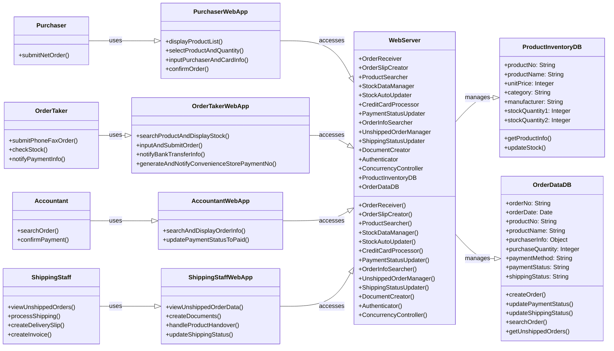
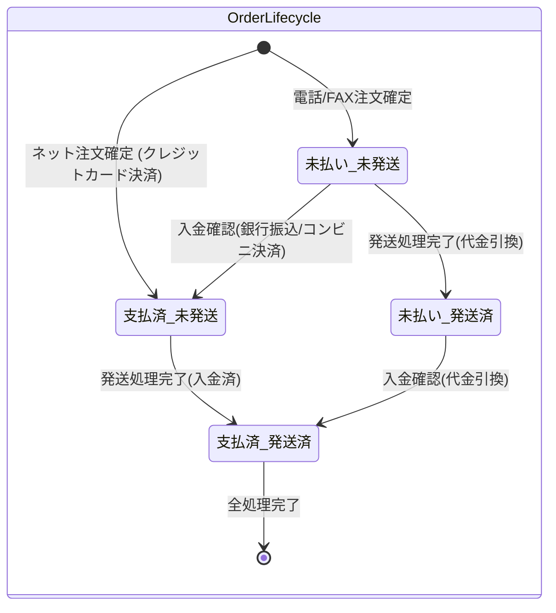

# 通信販売システム ソフトウェア詳細設計書

## 目次

|                                           |      |
| :---------------------------------------- | :--- |
| 1. 概要                                   | 3    |
| 2. プログラムユニット機能と構成設計       | 4    |
| 2.1 プログラムユニット一覧表              | 4    |
| 2.2 プログラムユニット構成図              | 5    |
| 3. プログラムユニット設計                 | 6    |
| 3.1 プログラムユニット詳細処理            | 6    |
| 3.2 プログラムユニット詳細処理            | 9    |
| 3.3 リソース定義                          | 9    |
| 3.4 システム初期化処理                    | 10   |
| 3.5 共通定義                              | 11   |
| 4. プログラムユニット・インタフェース設計 | 12   |
| 4.1 プログラムユニット間のインタフェース  | 12   |
| 4.2 インタフェース詳細                    | 12   |

## 1. 概要

### 本書の目的

本書は、通信販売システムのプログラムレベルの仕様 (詳細な振る舞いや論理構造など)を記述することを目的とする。

### 本書の位置づけ

本書は、通信販売システムの開発における 【3号開発ドキュメント】であり、後続のソースコーディングのインプット資料として使用される。

### 対象ユーザ

ソフトウェアの実装担当者 (プログラマ)、ソフトウェア単体テスト設計者である。

### 記載範囲、記載内容など

通信販売システムの実装すべき全てのプログラムを明確にし、コーディング可能なレベルに記述することを目指す。 ソフトウェア方式設計で定義された機能ユニットをプログラムユニットに分割し、詳細な振る舞いや論理構造などを設計する。

### 参照しているドキュメントなど

* 【通信販売システム 製品仕様書】
* 【通信販売システム ソフトウェア要求仕様書】
* 【通信販売システム ソフトウェア方式設計書】

### 定義(用語、略語など)

特になし

## 2. プログラムユニット機能と構成設計

### 2.1 プログラムユニット一覧表

本システムを構成するプログラムユニットとその機能概要を以下に示す。

| 機器           | 機能カテゴリ                       | プログラム名           | 機能概要                                                                                                                                                                   |
| :------------- | :--------------------------------- | :--------------------- | :------------------------------------------------------------------------------------------------------------------------------------------------------------------------- |
| サーバ         | 注文受付・管理モジュール           | Order Receiver         | ネット注文または電話/FAXによる注文情報を受け付け、内容を検証する処理を行う。                                                                                               |
|                |                                    | OrderSlipCreator       | 受信・検証済の注文情報をもとに注文データレコードを作成し、注文データ DBに格納する処理を行う。 電話/FAX注文は「未払い」、ネット注文は「支払済」として保存する。             |
|                | 商品・在庫管理モジュール           | ProductSearcher        | 商品番号または商品名で商品を検索し、在庫数量2や単価などの情報を取得・表示する機能、および商品リストを取得・表示する機能を提供する。                                        |
|                |                                    | Stock DataManager      | 商品在庫データ(商品番号、商品名、単価、カテゴリ、メーカー、在庫数量1、在庫数量2) を商品在庫 DBに格納・管理する処理を行う。                                                 |
|                |                                    | StockAutoUpdater       | 注文の発送状態が「発送済」となった際に、在庫数量1の値を自動的に更新し、在庫数量1と在庫数量2を一致させる処理を行う。                                                        |
|                | 決済・会計管理モジュール           | CreditCardProcessor    | クレジットカード情報の照合を行い、正当性が確認されれば決済完了とする処理を行う (外部決済システムとの連携は対象外)。                                                        |
|                |                                    | Payment Status Updater | 会計係による入金確認後、または代金引換の支払い確認後、該当する注文の支払い状態を「支払済」に更新する処理を行う。                                                           |
|                |                                    | OrderInfoSearcher      | 会計係が注文番号、注文日、または購入者氏名を入力して該当する注文情報を検索する処理を行う。                                                                                 |
|                | 発送管理モジュール                 | UnshippedOrderManager  | 未発送の注文データを管理し、商品発送係が閲覧できるように提供する。                                                                                                         |
|                |                                    | ShippingStatus Updater | 商品発送係による発送処理後、該当する注文の発送状態を「発送済」に更新する処理を行う。                                                                                       |
|                | システム基盤モジュール             | Document Creator       | 納品書(支払い済注文)、請求書と納品書(代金引換注文)を作成する処理を行う。                                                                                                   |
|                |                                    | Authenticator          | 注文受付係、会計係、商品発送係からのアクセスに対してパスワード認証を行う処理を行う。                                                                                       |
|                |                                    | Concurrency Controller | 商品データの同時操作におけるアクセス衝突を回避し、データの一貫性を保持するための排他制御機能を提供する。                                                                   |
| 購入者端末     | 購入者インタフェースモジュール     | PurchaserWebApp        | Web サーバへの接続、商品リストの表示と希望商品・数量の選択、購入者情報・クレジットカード情報の入力、注文確定機能を提供する。                                               |
| 注文受付係端末 | 注文受付係インタフェースモジュール | OrderTakerWebApp       | 注文受付画面を通じた商品検索と在庫確認表示、購入者情報・購入数量・支払い方法の入力と代理注文実行、銀行振込先情報の通知、コンビニ決済のお支払番号生成と通知機能を提供する。 |
| 会計係端末     | 会計係インタフェースモジュール     | Accountant WebApp      | 注文番号・注文日・購入者氏名による注文情報検索表示、入金確認後の支払い状態「支払済」更新操作機能を提供する。                                                               |
| 商品発送係端末 | 商品発送係インタフェースモジュール | Shipping StaffWebApp   | 未発送注文データの閲覧表示、納品書・請求書の作成、商品の倉庫からの取り出しと配達業者への引き渡し、発送状態「発送済」への変更操作機能を提供する。                           |

### 2.2 プログラムユニット構成図

本システムの主要なプログラムユニットとその関係性をクラス図として以下に示す。

**図1:クラス図**

* **アクター:** Purchaser, OrderTaker, Accountant, ShippingStaff
* **WebApps (インタフェース):**
  * `PurchaserWebApp`: `displayProductList()`, `selectProductAndSetQuantity()`, `inputPurchaserAndCardInfo()`, `confirmOrder()`
  * `OrderTakerWebApp`: `searchProductAndDisplayStock()`, `inputAndSubmitOrder()`, `notifyBankTransferInfo()`, `generateAndNotifyConvenienceStorePaymentNo()`
  * `AccountantWebApp`: `searchAndDisplayOrderInfo()`, `updatePaymentStatusToPaid()`
  * `ShippingStaffWebApp`: `viewUnshippedOrderData()`, `createDocuments()`, `handleProductsAndOver()`, `updateShippingStatus()`
* **WebServer:**
  * `OrderReceiver`, `OrderSlipCreator`, `ProductSearcher`, `StockDataManager`, `StockAutoUpdater`, `CreditCardProcessor`, `PaymentStatusUpdater`, `OrderInfoSearcher`, `UnshippedOrderManager`, `ShippingStatusUpdater`, `DocumentCreator`, `Authenticator`, `ConcurrencyController`
  * メソッド: `OrderReceiver()`, `OrderSlipCreator()`, `ProductSearcher()`, `StockDataManager()`, `StockAutoUpdater()`, `CreditCardProcessor()`, `PaymentStatusUpdater()`, `OrderInfoSearcher()`, `UnshippedOrderManager()`, `ShippingStatusUpdater()`, `DocumentCreator()`, `Authenticator()`, `ConcurrencyController()`
* **データベース (manages):**
  * `ProductInventoryDB`: `productNo: String`, `productName: String`, `unitPrice: Integer`, `category: String`, `manufacturer: String`, `stockQuantity1: Integer`, `stockQuantity2: Integer`, `getProductInfo()`, `updateStock()`
  * `OrderDataDB`: `orderNo: String`, `orderDate: Date`, `productNo: String`, `productName: String`, `purchaserInfo: Object`, `purchaseQuantity: Integer`, `paymentMethod: String`, `paymentStatus: String`, `shippingStatus: String`, `createOrder()`, `updatePaymentStatus()`, `updateShippingStatus()`, `searchOrder()`, `getUnshippedOrders()`

## 3. プログラムユニット設計

### 3.1 プログラムユニット詳細処理

各プログラムユニットの主要な処理内容、引数、戻り値、および制約事項を以下に示す。

| プログラム名           | 引数                                                                                                                                                                                                                                                                             | 戻り値                                                                                                                                   | 処理内容                                                                                                                                                                                                   | 制約事項                                                                                                                              |
| :--------------------- | :------------------------------------------------------------------------------------------------------------------------------------------------------------------------------------------------------------------------------------------------------------------------------- | :--------------------------------------------------------------------------------------------------------------------------------------- | :--------------------------------------------------------------------------------------------------------------------------------------------------------------------------------------------------------- | :------------------------------------------------------------------------------------------------------------------------------------ |
| Order Receiver         | `orderInfo` (JSON): - `type`: "net" or "phonefax" - `productDetails`: `[{productNo, quantity}]` - `purchaserInfo`: `{name, address, contact}` - `paymentMethod`: String - `creditCardInfo`: `{cardNumber, holderName, expiryDate, securityCode}` (ネット注文のみ) | `result` (JSON): - `status`: "success" or "failure" - `message`: String - `errorCode`: String (失敗時)                          | 注文受付端末(またはネット注文) から送信された注文情報を受け付け、データの形式および内容を検証する。必須項目が不足している場合や、商品番号が無効な場合はエラーを返す。                                      | システムの応答時間は2秒以内であること。無効な入力の場合エラーメッセージを端末に表示する。在庫が不足している場合は注文を受け付けない。 |
| OrderSlipCreator       | `validatedOrderInfo` (Object): OrderReceiverからの検証済み注文情報。                                                                                                                                                                                                             | `result` (JSON): - `status`: "success" or "failure" - `orderNo`: String (成功時)                                                   | 検証済みの注文情報から、注文データ構造に基づきレコードを作成し、注文データDBに格納する。支払い状態は、電話/FAX注文は「未払い」、ネット注文は「支払済」として初期設定する。同時アクセス時は排他制御を行う。 | 注文データ DBへの接続・書き込み権限が必要。同時書き込みに対する排他制御が必要。                                                       |
| ProductSearcher        | `searchCriteria` (JSON): - `type`: "productNo" or "productName" - `value`: String                                                                                                                                                                                          | `result` (JSON): - `status`: "success" or "failure" - `products`: `[{productNo, productName, unitPrice, stockQuantity2}]` (成功時) | 指定された検索条件に基づき、商品在庫DBから商品情報(在庫数量2、単価などを含む)を検索し、結果を返す。                                                                                                        | 商品在庫DBの接続・参照権限が必要。複数の注文者による同時アクセスをサポートし、データ一貫性を保持する。                                |
| PaymentStatusUpdater   | `updateInfo` (JSON): - `orderNo`: String - `paymentStatus`: "paid" - `confirmUser`: String (会計係 ID)                                                                                                                                                                  | `result` (JSON): - `status`: "success" or "failure"                                                                                   | 会計係からの入金確認情報を受け付け、指定された注文番号の支払い状態を注文データDBで「支払済」に更新する。代金引換の場合も同様に更新する。                                                                   | 注文データ DBへの更新権限が必要。該当注文が存在しない場合はエラーを返す。                                                             |
| ShippingStatusUpdater  | `updateInfo` (JSON): - `orderNo`: String - `shippingStatus`: "shipped" - `shippingUser`: String (商品発送係 ID)                                                                                                                                                         | `result` (JSON): - `status`: "success" or "failure"                                                                                   | 商品発送係からの発送完了情報を受け付け、指定された注文番号の発送状態を注文データ DBで「発送済」に更新する。同時にStockAutoUpdaterを呼び出し、在庫数量1を更新する。                                         | 注文データ DBへの更新権限が必要。- StockAutoUpdaterが正常に完了すること。                                                             |
| Document Creator       | `orderData` (Object): 注文データ DBから取得した注文情報。                                                                                                                                                                                                                        | `documentPath` (String)または `result` (JSON): - `status`: "success" or "failure"                                                     | 注文データをもとに、支払い方法に応じて納品書または請求書と納品書を生成し、印刷用またはPDF出力用の形式で準備する。                                                                                          | 適切な印刷レイアウトとテンプレートが定義されていること。印刷(またはPDF出力) システムとの連携が必要。                                  |
| Authenticator          | `credentials` (JSON): - `userId`: String - `password`: String                                                                                                                                                                                                              | `result` (JSON): - `authenticated`: Boolean - `userRole`: String (認証成功時)                                                      | 注文受付係、会計係、商品発送係からのアクセスに対して、ユーザIDとパスワードの照合を行い認証する。                                                                                                           | ユーザ認証情報のDBまたはディレクトリサービスへの接続が必要。パスワードは暗号化して保存されていること。                                |
| Concurrency Controller | `resourceId`: String (操作対象リソース ID) - `operationType`: String ("read", "write")                                                                                                                                                                                        | `result` (Boolean): - `lockAcquired`: Boolean                                                                                         | 複数の注文者による商品データや注文データの同時操作において、アクセス衝突を回避しデータ一貫性を保持するための排他制御(ロック機構など)を実装する。                                                           | データベースのトランザクション管理機能を利用。デッドロックの発生を回避するメカニズムが必要。                                          |

### 3.2 プログラムユニット詳細処理

本システムにおける注文データの支払い状態と発送状態の遷移を以下に示す。

**図2:注文データの支払い状態と発送状態の遷移図**

* **フロー:**
  * 電話/FAX注文確定 → `未払い_未発送`
    * 入金確認(銀行振込/コンビニ決済) → `支払済_未発送`
    * 発送処理完了(代金引換) → `未払い_発送済`
      * 入金確認(代金引換) → `支払済_発送済`
  * ネット注文確定(クレジットカード決済) → `支払済_未発送`
    * 発送処理完了(入金済) → `支払済_発送済`

* **最終状態:** `支払済_発送済` → 全処理完了

* **状態定義:**
  * **未払い\_未発送:** 電話またはFAXによる注文が確定された直後の状態。 支払いも発送もまだ行われていない。
  * **支払済\_未発送:** ネット注文 (クレジットカード決済)が確定された直後、または電話/FAX注文において入金が確認された状態。 発送はまだ行われていない。
  * **未払い\_発送済:** 代金引換の電話/FAX注文において、商品が発送されたが、まだ代金が購入者から徴収され、会計係に入金が確認されていない状態。
  * **支払済\_発送済:** 商品が発送され、かつ支払いが完了した状態。 代金引換の場合は会計係による入金確認後にこの状態となる。

### 3.3 リソース定義

| リソース名     | 用途                                                     | 構造（主要フィールド）                                                                                                                                                                                                                                          | サイズ見積もり                                   | 取得・解放/利用時の注意点                                                                        |
| :------------- | :------------------------------------------------------- | :-------------------------------------------------------------------------------------------------------------------------------------------------------------------------------------------------------------------------------------------------------------- | :----------------------------------------------- | :----------------------------------------------------------------------------------------------- |
| 商品在庫DB     | 商品情報と現在の在庫数を管理する。                       | - 商品番号(PK): String - 商品名: String - 単価: Integer - 商品カテゴリ: String - メーカー名: String - 在庫数量1: Integer (現在倉庫保管) - 在庫数量2: Integer (注文済み未発送を除いた在庫)                                                     | 1商品あたり約XXKB 全商品で合計約YYMB          | 同時更新時の排他制御が必要。在庫数量1と在庫数量2の一貫性維持。                                   |
| 注文データDB   | 全ての注文の履歴、支払い状況、発送状況を管理する。       | - 注文番号(PK): String - 注文日: Date - 商品番号: String - 商品名: String - 購入者情報: {氏名, 住所, 連絡先} - 購入数量: Integer - 支払い方法: String - 支払い状態: String ("未払い", "支払済") - 発送状態: String ("未発送", "発送済") | 1注文あたり約ZZKB 3ヶ月分のデータで合計約AAGB | 同時アクセス時の排他制御が必要。個人情報は暗号化して保存。3ヶ月経過後には廃棄を検討。            |
| ユーザ認証情報 | 注文受付係、会計係、商品発送係のログイン情報を管理する。 | - ユーザID (PK): String - パスワード(ハッシュ値): String - ロール: String ("注文受付係", "会計係", "商品発送係")                                                                                                                                          | 数 KB                                            | パスワードはハッシュ化して保存。アクセス制御の厳格な管理が必要。                                 |
| ログデータ     | システムの動作履歴、エラー、異常発生時の情報を記録する。 | - タイムスタンプ - イベント種類 ("INFO", "WARN", "ERROR") - メッセージ - 関連情報 (注文ID, ユーザIDなど)                                                                                                                                               | 日次でXXMB 合計YYGB                           | 各機器内に保存し、デバッグモードや管理者権限で取得可能であること。ローテーション方法を別途検討。 |

### 3.4 システム初期化処理

本システムのサーバおよび各端末の初期化処理は以下の手順で実施される。

* **サーバの初期化:**
  1. Web サーバーソフトウェアの起動と常時運用状態への移行。
  2. 商品在庫 DB および注文データ DBへの接続確立と、データベースが健全な状態であることの確認。 必要に応じてマイグレーション処理を実行する。
  3. 既存データの読み込みとメモリへのキャッシュ (パフォーマンス最適化のため、もしあれば)。
  4. 定期的なデータバックアップスケジュールの設定。
  5. ログ収集機能の初期化とログファイルへの書き込み開始。
  6. 「通常運用モード」での起動。 メンテナンスモードへの移行は管理者操作による。
* **各端末(注文受付係、会計係、商品発送係用端末)の初期化:**
  1. OSの起動と Web ブラウザの起動。
  2. Web ブラウザを通じてWeb サーバへの接続確立。
  3. ログイン画面の表示と、オペレーターによるパスワード認証の要求。 認証成功後、担当者ごとの専用インタフェースが表示される。
  4. ログ収集機能の初期化 (端末側でのログ記録が必要な場合)。
* **購入者端末 (PC, スマートフォン、タブレット)の初期化:**
  1. OSの起動。
  2. モバイルアプリケーションまたは Web ブラウザを通じて Web サーバへのアクセス。
  3. 商品リスト表示画面の自動表示。
  4. ログ収集機能の初期化 (端末側でのログ記録が必要な場合)。

### 3.5 共通定義

本システムで共通的に使用される定義を以下に示す。

* **エラー値:**
  * エラー No.01: 注文受付時に、存在しない商品番号や不適切な数量が入力された場合、注文受付端末または購入者端末に「無効な入力です」などのエラーメッセージを表示する。
  * エラー No.02: サーバと端末間のネットワーク接続が切断された場合、「ネットワークエラーが発生しました」などのエラーメッセージを端末に表示する。
* **異常:**
  * 異常 No.01: 商品の在庫数量が不足している場合、注文受付係端末または購入者端末に「在庫が不足しています」などのメッセージを表示し、注文を受け付けない。
* **リソースのサイズ:**
  * Web サーバは、商品在庫DBおよび注文データDBを格納・管理するため、十分なハードディスク容量を確保する必要がある。 具体的には、過去3ヶ月分の注文データを保存できるように設計する。 詳細なサイズは3.3節の 「サイズ見積もり」に記述する。

## 4. プログラムユニット・インタフェース設計

### 4.1 プログラムユニット間のインタフェース

* **同一機器内のプログラムユニット間:** 各機器内部のプログラムユニット間は、直接的な関数呼び出し(direct call) により連携する。 これは、処理の効率性を最大化するためである。
* **機器間のプログラムユニット間:** サーバと各端末間、および端末と外部サービス (クレジットカード決済など) 間のプログラムユニット間は、通信プロトコル (主にHTTP/HTTPS)を用いてメッセージ駆動型でデータや要求のやり取りを行う。 各端末はローカルネットワーク (Wi-Fi等)を介してWeb サーバに接続し、端末同士が直接通信することはない。

### 4.2 インタフェース詳細

主要なAPIとその詳細を以下に示す。

| 機器間インタフェース                          |                    呼び出し方法                    | 結果                                                                                                                                                                     | データフォーマット                                                                                                                                                                                                                                                                                                                                                                                                   | 制約事項                                                                                                                                                           |
| :-------------------------------------------- | :------------------------------------------------: | :----------------------------------------------------------------------------------------------------------------------------------------------------------------------- | :------------------------------------------------------------------------------------------------------------------------------------------------------------------------------------------------------------------------------------------------------------------------------------------------------------------------------------------------------------------------------------------------------------------- | :----------------------------------------------------------------------------------------------------------------------------------------------------------------- |
| 購入者端末 → Web サーバ: ネット注文送信       |            POST /api/orders/net (HTTPS)            | 成功: HTTP 200 OK `{"status": "success", "orderNo": "ORDxxxx"}` 失敗: HTTP 400 Bad Request/500 Internal Server Error `{"status": "failure", "message": "エラー詳細"}` | **リクエスト (JSON):** - `productDetails`: `[{productNo: String, quantity: Integer}]` - `purchaserInfo`: `{name: String, address: String, contact: String}` - `creditCardInfo`: `{cardNumber: String, holderName: String, expiryDate: String, securityCode: String}` - `shippingFee`: 660 (固定値) **レスポンス (JSON):** 上記「結果」参照。                                                          | - `productNo`と`quantity` は有効な値であること。 - `creditCardInfo` は適切に暗号化されていること。 - 同時アクセス衝突の回避。 - レスポンス時間は2秒以内。 |
| 注文受付係端末 → Web サーバ: 電話/FAX注文登録 |         POST /api/orders/phonefax (HTTPS)          | 成功: HTTP 200 OK `{"status": "success", "orderNo": "ORDxxxx"}` 失敗: HTTP 400 Bad Request/500 Internal Server Error `{"status": "failure", "message": "エラー詳細"}` | **リクエスト (JSON):** - `productDetails`: `[{productNo: String, quantity: Integer}]` - `purchaserInfo`: `{name: String, address: String, contact: String}` - `paymentMethod`: String ("bankTransfer", "convenienceStore", "cashOnDelivery") - `fees`: `{convenienceStoreFee: Integer (220), cashOnDeliveryFee: Integer (330), shippingFee: Integer (660)}` **レスポンス (JSON):** 上記「結果」参照。 | - パスワード認証が必要。 - `productNo`と`quantity` は有効な値であること。 - 同時アクセス衝突の回避。 - レスポンス時間は2秒以内。                          |
| 各端末 → Web サーバ: 商品検索                 |          GET /api/products/search (HTTPS)          | 成功: HTTP 200 OK `{"status": "success", "products": [...]}` 失敗: HTTP 400 Bad Request/500 Internal Server Error `{"status": "failure", "message": "エラー詳細"}`    | **リクエスト (Query Parameters):** - `searchType`: "productNo" or "productName" - `searchValue`: String **レスポンス (JSON):** - `products`: `[{productNo: String, productName: String, unitPrice: Integer, stockQuantity2: Integer}]`                                                                                                                                                                   | - `searchValue` は適切な長さと形式であること。 - 注文受付係からのアクセスにはパスワード認証が必要。 - レスポンス時間は2秒以内。                              |
| 会計係端末 → Web サーバ: 支払い状態更新       | PUT /api/orders/{orderNo}/payment\_status (HTTPS)  | 成功: HTTP 200 OK `{"status": "success"}` 失敗: HTTP 400 Bad Request/404 Not Found/500 Internal Server Error `{"status": "failure", "message": "エラー詳細"}`         | **リクエスト (JSON):** - `paymentStatus`: "paid" - `confirmedBy`: String (会計係ユーザID) **レスポンス (JSON):** 上記「結果」参照。                                                                                                                                                                                                                                                                         | - パスワード認証が必要。 - `orderNo` は既存の有効な注文番号であること。 - レスポンス時間は2秒以内。                                                          |
| 商品発送係端末 → Web サーバ: 発送状態更新     | PUT /api/orders/{orderNo}/shipping\_status (HTTPS) | 成功: HTTP 200 OK `{"status": "success"}` 失敗: HTTP 400 Bad Request/404 Not Found/500 Internal Server Error `{"status": "failure", "message": "エラー詳細"}`         | **リクエスト (JSON):** - `shippingStatus`: "shipped" - `shippedBy`: String (商品発送係ユーザID) **レスポンス (JSON):** 上記「結果」参照。                                                                                                                                                                                                                                                                   | - パスワード認証が必要。 - `orderNo` は既存の有効な注文番号であること。 - レスポンス時間は2秒以内。                                                          |
