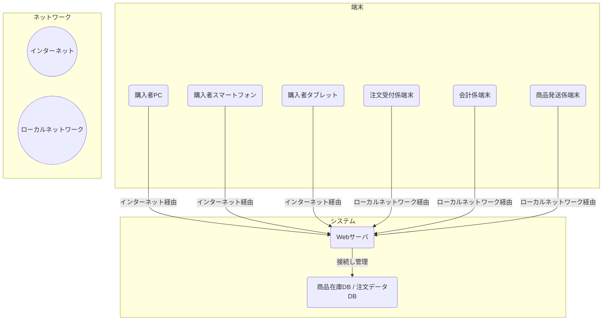

# 通信販売システム ソフトウェア要求仕様書

## 目次

|                               |      |
| :---------------------------- | :--- |
| 1. 概要                       | 3    |
| 2. システム構成..             | 4    |
| 3. 機能概要                   | 6    |
| 4. 制約条件                   | 7    |
| 5. ユースケース               | 8    |
| 6. 機能詳細.                  | 10   |
| 7. インタフェース詳細.....    | 12   |
| 8. 性能・品質等非機能要求詳細 | 13   |

***

## 1. 概要

### 本書の目的

本書は、通信販売システムの要件を明確化することを目的とする。

### 本書の位置づけ

本書は、通信販売システムの開発における 【1号開発ドキュメント】であり、後続のソフトウェア設計のインプット資料として使用される。

### 対象ユーザ

ソフトウェア方式設計者、ソフトウェア詳細設計者、ソフトウェア総合テスト設計者である。

### 記載範囲、記載内容など

通信販売システムの各機器で実現すべき機能項目を列挙し、記述する。

### 参照しているドキュメントなど

【通信販売システム 製品仕様書】

### 定義(用語、略語など)

(必要に応じて追記する)

***

## 2. システム構成

### システム全体構成

本システムは、Webサーバ1台と複数の端末から構成される。

端末は購入者端末 (PC、スマートフォン、タブレット)、注文受付係用端末、会計係用端末、商品 発送係用端末がある。

各端末は Web サーバヘアクセスし、パスワードによる認証が必要となる(ネット購入者は除く)。 Web サーバは、注文受付係、会計係、商品発送係、およびネット注文による購入者のそれぞれに対し、専用のインタフェースを提供する。

ネット注文でモバイル端末を使用する場合は Android スマートフォンに限定され、Webサーバへのアクセスはローカルネットワーク経由となる。

**図1:システム構成**

### ソフトウェアに求められる要求仕様

#### (i) Webサーバソフトウェア

注文受付端末からの情報入力、購入者端末からのネット注文情報の受付、これらの情報の処理・保存、商品在庫管理、商品検索、注文データ管理、発送管理を統一された形式で実現する機能。また、パスワード認証や複数注文者によるアクセス衝突回避、データー貫性保持も含む。

#### (ii)購入者端末ソフトウェア

Webアプリケーションまたはモバイルアプリケーションを通じてWebサーバにアクセスし、 商品リストからの商品・数量選択、氏名・住所・連絡先・クレジットカード情報入力、注文確定を行う機能。

#### (iii)注文受付係端末ソフトウェア

Web サーバにアクセスし、在庫確認、注文データの登録、購入者情報・支払い方法の入力、 支払い先情報(銀行振込・コンビニ決済)の通知を行う機能。

#### (iv)会計係端末ソフトウェア

Web サーバにアクセスし、注文番号・注文日・購入者氏名による注文情報検索、入金確認後の支払い状態更新を行う機能。

***

#### (v)商品発送係端末ソフトウェア

Web サーバにアクセスし、未発送注文データの閲覧、支払い確認済み注文に対する納品書作成、倉庫からの商品取り出し、配達業者への商品引き渡し、発送状態の更新を行う機能。

***

## 3. 機能概要

本章では、システムとして実現・提供する機能のうち、ソフトウェアで実現する機能のリストとその概要を記述する。

### Web サーバソフトウェアの機能概要

* ネット注文情報の受付と処理を行う機能。
* 電話・FAXによる注文情報を受け付け、処理する機能。
* 商品在庫管理データをデータベースに格納・管理する機能。
* 注文データをデータベースに格納・管理する機能。
* 商品検索機能を提供する機能。
* 注文データの支払い状態および発送状態を更新する機能。
* 在庫数量を自動更新する機能。
* 注文受付係、会計係、商品発送係、およびネット注文購入者に対し専用のインタフェースを提供する機能。
* パスワードによる認証機能を提供する機能。
* 商品データの同時操作 (商品検索、在庫データ更新、注文データ更新など)をサポートし、複数の注文者によるアクセス衝突を回避しデーター貫性を保持する機能。

### 購入者端末ソフトウェアの機能概要

* Webサーバにアクセスし、商品リストを表示する機能。
* 希望する商品と数量を選択する機能。
* 氏名、住所、連絡先、クレジットカード情報(カード番号、名義人、有効期限、セキュリティコード)を入力する機能。
* 注文を確定する機能。
* オンラインでのクレジットカード決済を完了する機能(照合のみ)。

### 注文受付係端末ソフトウェアの機能概要

* 注文内容に基づき、商品の在庫状況および在庫数量を確認する機能。
* 購入者情報および支払い方法を含めた注文内容をシステムに登録する機能。
* 銀行振込の場合に振込先情報、コンビニ決済の場合にお支払番号を生成し購入者に通知する機能。

### 会計係端末ソフトウェアの機能概要

* 注文番号、注文日、または購入者氏名を入力して該当する注文情報を検索する機能。
* 入金確認後、その注文の支払い状態を「支払済」に更新する機能。

### 商品発送係端末ソフトウェアの機能概要

* 未発送の注文データを閲覧する機能。
* 納品書および請求書を作成する機能。
* 商品の倉庫からの取り出しを行い、配達業者に引き渡す機能。
* 発送後、注文の発送状態を「発送済」に変更する機能。

***

## 4. 制約条件

本章では、通信販売システムにおけるソフトウェア開発に関する制約条件を記述する。

### Web サーパ

* OS: Ubuntu 20.04 LTS
* 開発するソフトウェア: Web アプリケーション
* 使用する DBMS: SQLite
* 使用する API:

### 購入者端末 (モバイル端末の場合)

* OS: Android 10以降のバージョン
* 開発するソフトウェア: Android アプリケーションもしくはWebアプリケーション

### 購入者端末 (PCの場合)

* OS: Windows または MacOS
* 開発するソフトウェア: Web アプリケーション

### 注文受付係、会計係、商品発送係用端末

* PCを利用することを想定し、OSはWindows または MacOS、開発するソフトウェアは Web アプリケーションとする。

***

## 5. ユースケース

本章では、通信販売システムのユースケースと、主要なユースケースの記述について詳述する。

**図2: ユースケース図**

\[Image of a Use Case diagram showing actors like "注文受付係" (Order Clerk), "会計係" (Accounting Clerk), "商品発送係" (Shipping Clerk), and "購入者" (Purchaser) interacting with use cases such as "電話/FAX注文" (Phone/FAX Order), "注文受付" (Order Reception), "会計" (Accounting), "発送" (Shipping), and "ネット注文" (Online Order).]

### 「ネット注文」 ユースケース

購入者は、モバイルアプリケーションまたは Web アプリケーションを通じてWeb サーバにアクセスし、商品リストから希望する商品と数量を選択する。

その後、氏名、住所、連絡先、クレジットカード情報 (カード番号、名義人、有効期限、セキュリティコード)を入力し、注文を確定する。

1件の発送につき、配送料として一律660円が加算される。

クレジットカード決済はオンラインで行われ、注文完了と同時に支払い状態は即時に「支払済」となる。

商品発送係は、クレジットカード決済が完了している注文に対して、納品書の作成および商品の倉庫からの取り出しを行い、商品を配達業者に引き渡す。

### 「電話・FAXによる注文」 ユースケース

購入者は、カタログやテレビ広告などを参考に購入したい商品を決定し、電話またはFAXで、商品番号、商品名、購入数量、購入者氏名、住所、連絡先、支払い方法を注文受付係に伝える。

注文受付係は、商品の在庫状況および在庫数量を確認し、問題がなければ注文を受け付ける。

***

銀行振込またはコンビニ決済の場合は支払い先情報を購入者に通知する。

コンビニ決済では1件の注文につき手数料220円、代金引換の場合は代引き手数料330円、1件の発送につき配送料660円(全国一律)が加算される。

会計係は、各注文について入金の有無を確認し、支払い状況を更新する。

商品発送係は、支払いが確認された注文に対し、納品書の作成および倉庫からの商品の取り出しを行い、配達業者に商品を引き渡す。

支払い方法が代金引換の場合は、納品書および請求書を作成し、商品とともに配達業者に引き渡す。

### 「会計」ユースケース

会計係は、注文番号、注文日、または購入者氏名を入力することで、該当する注文情報を検索できる。

また、支払い方法(銀行振込、コンビニ決済、代金引換)のいずれかにより既に入金が確認された場合は、その注文の支払い状態を「支払済」に更新する。

### 「発送」 ユースケース

商品発送係は、未発送の注文データを閲覧し、銀行振込またはコンビニ決済で支払い済みの注文、代金引換での注文、ネット注文 (クレジットカード決済完了済み)のいずれかに対し、注文データをもとに納品書 (代金引換の場合は請求書も)を作成し、商品の倉庫からの取り出しを行い、商品を配達業者に引き渡す。

発送後、注文の発送状態を「発送済」に変更する。

***

## 6. 機能詳細

本章では、上記のユースケースを実現するための各機能の詳細を記述する。

### Web サーバソフトウェアの機能詳細

* \[サ-Req01] ネット注文による購入者からの注文情報(商品リスト、数量、購入者情報、クレジットカード情報)を受け付け、検証する機能。
* \[サ-Req02] 注文受付係による電話/FAX注文の入力情報(商品番号、商品名、数量、購入者情報、支払い方法)を受け付け、検証する機能。
* \[サ-Req03] 受け付けた注文情報をもとに、注文データレコードを作成し、注文データDBに格納する機能。
* \[サ-Req04] 商品在庫データ (商品番号、商品名、単価、商品カテゴリ、メーカー名、在庫数量1(現在倉庫に保管されている数量)、在庫数量2 (注文済みのうち、未発送の数量を除いた在庫))を商品在庫DBに格納・管理する機能。
* \[サ-Req05] 注文の発送状態が「発送済」となった際に、在庫数量1の値を自動的に更新し、在庫数量1と在庫数量2を一致させる機能。
* \[サ-Req06] 注文受付係による注文に対して、支払い状態を初期状態で「未払い」として保存する機能。
* \[サ-Req07] ネット注文に対して、クレジットカード決済完了と同時に支払い状態を「支払済」として保存する機能。
* \[サ Req08] 会計係による入金確認後、該当する注文の支払い状態を「支払済」に更新する機能。
* \[サ-Req09] 商品発送係による発送処理後、該当する注文の発送状態を「発送済」に更新する機能。
* \[サ-Req10] 注文受付係が商品番号または商品名で商品を検索し、在庫数量2や単価などの情報を表示する機能。
* \[サ-Req11] ネット注文による購入者が商品名で商品を検索し、商品リストを表示する機能。
* \[サ-Req12]注文受付係、会計係、商品発送係からのアクセスに対してパスワード認証を行う機能。
* \[サ-Req13] 注文受付係およびネット注文による購入者による商品データの同時操作(商品検索、在庫データ更新、注文データ更新など)をサポートし、複数の注文者によるアクセス衝突を回避し、データの一貫性を保持する機能。

### 購入者端末ソフトウェアの機能詳細

* \[購-Req01] モバイルアプリケーションまたはWebアプリケーションを通じて Web サーバにアクセスする機能。
* \[購-Req02] 商品リストを表示し、希望する商品と数量を選択する機能、
* \[購-Req03]氏名、住所、連絡先、クレジットカード情報 (カード番号、名義人、有効期限、セキュリティコード)を入力する機能。
* \[購-Req04] クレジットカード情報の照合を行い、正当性が確認されれば決済完了とする機能。
* \[購-Req05]注文確定を行う機能。

### 注文受付係端末ソフトウェアの機能詳細

* \[受-Req01] 注文受付画面を通じて、商品番号または商品名、あるいはその両方を入力して商品を検索し、表示された在庫数量2や単価などの情報を確認する機能。
* \[受-Req02] 購入者情報、購入数量、支払い方法を入力し、代理で注文を行う機能.
* \[受-Req03] 銀行振込の振込先の銀行名と口座番号を通知する機能。
* \[受-Req04] コンビニ決済の支払いに必要なお支払番号を生成し、通知する機能。

### 会計係端末ソフトウェアの機能詳細

* \[会-Req01]注文番号、注文日、または購入者氏名を入力することで、該当する注文情報を検索する機能。
* \[会-Req02] 支払い方法(銀行振込、コンビニ決済、代金引換)のいずれかにより入金が確認された場合、その注文の支払い状態を「支払済」に更新する機能。

### 商品発送係端末ソフトウェアの機能詳細

* \[発-Req01] 未発送の注文データを閲覧する機能。
* \[発-Req02] 銀行振込またはコンビニ決済で支払い済みの注文データをもとに納品書を作成する機能。
* \[発-Req03] 代金引換での注文データをもとに請求書と納品書を作成する機能。
* \[発-Req04] クレジットカード決済が完了しているネット注文データをもとに納品書を作成する機能。
* \[発-Req05] 納品書(および請求書)を含めて商品を配達業者に引き渡す機能。
* \[発-Req06] 商品発送後、注文の発送状態を「発送済」に変更する機能。

***

## 7. インタフェース詳細

本章では、通信販売システムの各コンポーネント間のインタフェース詳細を記述する。

* Web サーバと購入者端末、注文受付係端末、会計係端末、商品発送係用端末は、ローカルネットワークを介して通信を行う。
* 各端末はサーバを経由して情報のやり取りを行い、端末同士が直接通信することはない。

***

## 8. 性能・品質等非機能要求詳細

本章では、通信販売システムの性能・品質等非機能要求詳細を記述する。

製品仕様書において省略されている項目があるため、記述可能な範囲に留める。

### 効率性

* 省略

### 信頼性

* Web サーバは、注文受付係およびネット注文による購入者による商品データの同時操作をサポートし、複数の注文者によるアクセスの衝突を回避するとともに、データの一貫性を保持する必要がある。

### 使用性

* ネットワーク経由でのシステムレスポンス時間 (ユーザが操作してから画面に結果が表示されるまでの時間)は、2秒以内であること。
* 注文受付係と商品発送係は、それぞれ同時に1名のみがシステムを使用する想定であるが、ネット注文者については同時に複数人の利用を想定している。

### 保守性

* 省略

### 拡張性

* 省略

### セキュリティ性

* 注文受付係、会計係、商品発送係がWeb サーバ アクセスする際には、パスワードによる認証が必要である。
