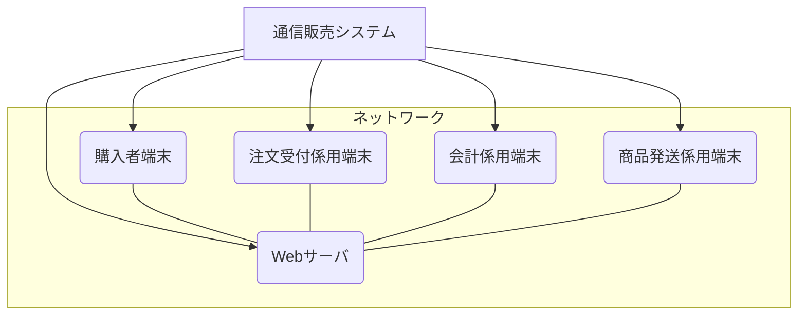
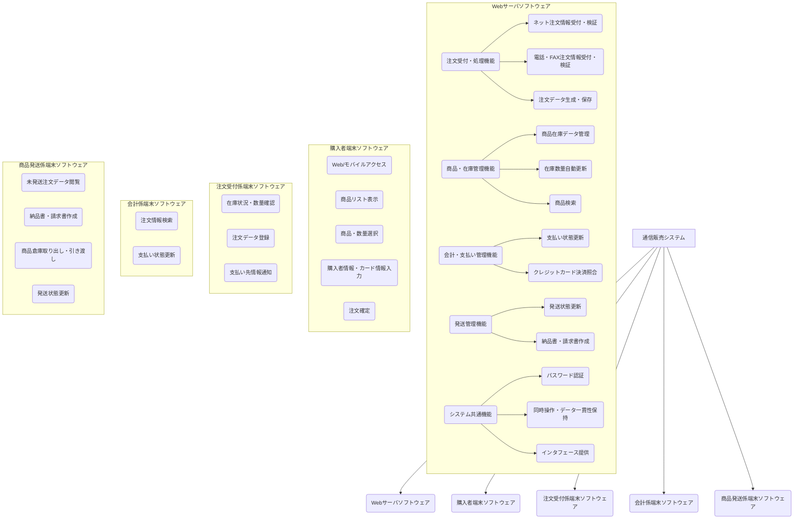
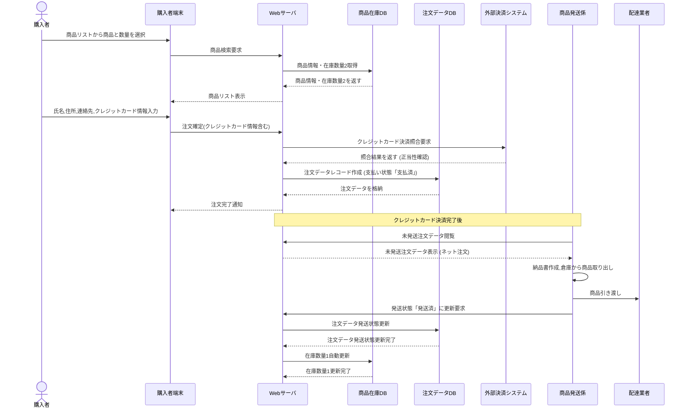
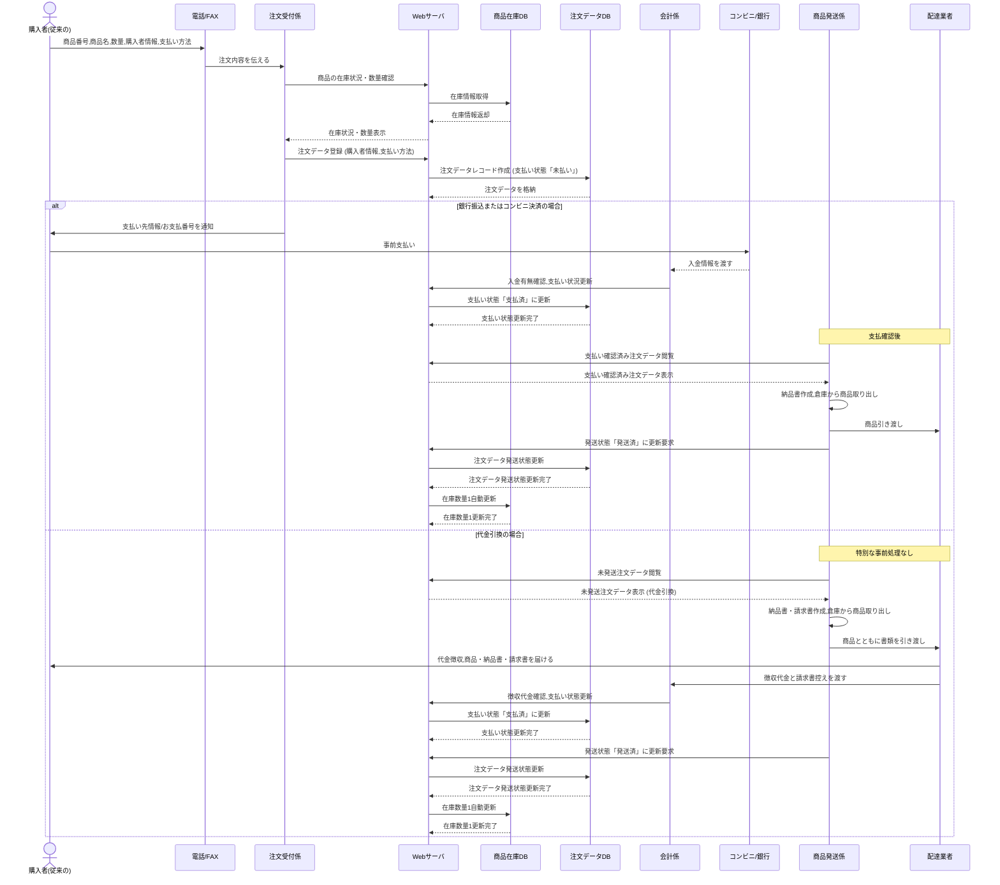
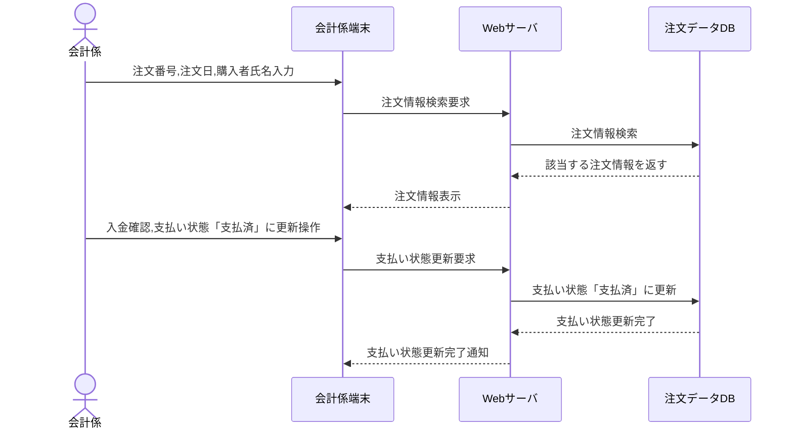
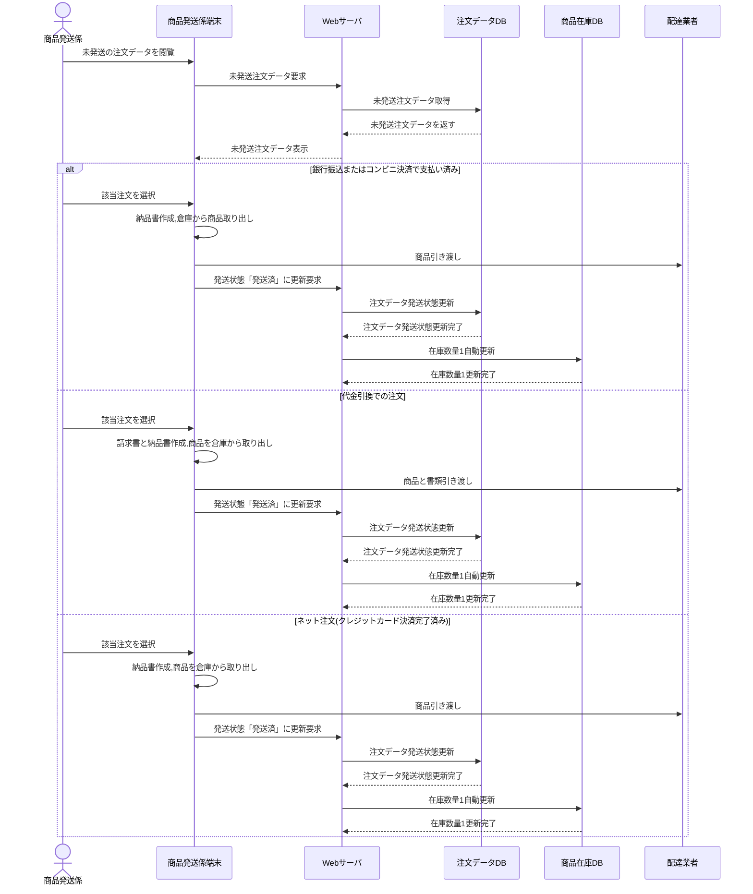

# 通信販売システム ソフトウェア方式設計書

## 目次

|                          |      |
| :----------------------- | :--- |
| 1. 概要                  | 3    |
| 2. システム構成..        | 4    |
| 3. ソフトウェア構成      | 6    |
| 4. 制御方式,             | 14   |
| 4.1 ソフトウェア制御方式 | 14   |
| 4.2 性能見積....         | 14   |
| 5. 機能ユニット詳細      | 15   |
| 6. システムで扱うデータ  | 17   |
| 7. その他...             | 18   |
| 7.1 エラー/異常情報一覧. | 18   |
| 7.2 共通制御情報詳細..   | 18   |

## 1. 概要

* **本書の目的**
  本章では、通信販売システムのソフトウェア構造を記述する。

* **本書の位置づけ**
  本書は、通信販売システムの開発における 【2号開発ドキュメント】であり、後続のソフトウェア設計のインプット資料として使用される。

* **対象ユーザ**
  ソフトウェア詳細設計者、ソフトウェア総合テスト設計者である。

* **記載範囲、記載内容など**
  通信販売システムの実現すべき全ての機能を明確にし、詳細設計可能なレベルで記述する。

* **参照しているドキュメントなど**
  * 【通信販売システム 製品仕様書】
  * 【通信販売システム ソフトウェア要求仕様書】

* **定義(用語、略語など)**
  (必要に応じて追記する)

## 2. システム構成

本章では、システムの全体構成と、それを構成する主たるソフトウェア機能(要素)の階層構成について記述する。

### 2.1 システム全体構成

本システムは、1台のWebサーバと複数の端末 (購入者端末、注文受付係用端末、会計係用端末、商品発送係用端末)から構成される。各端末は Web サーバヘアクセスし、パスワードによる認証が必要となる(ネット購入者は除く)。Webサーバは、注文受付係、会計係、商品発送係、およびネット注文による購入者のそれぞれに対し、専用のインタフェースを提供する。ネット注文でモバイル端末を使用する場合は Android スマートフォンに限定され、Web サーバへのアクセスはローカルネットワーク経由となる。端末間では直接通信を行わない。

**図1:システム構成**

### 2.2 システムを構成する主たるソフトウェア機能(要素)

各機器におけるソフトウェアの階層構成は以下の通りである。

* **Web サーバソフトウェア**
  * OS: Ubuntu 20.04 LTS
  * 開発するソフトウェア: Web アプリケーション
  * 使用する DBMS: SQLite
  * 最上位層の Web サーバアプリが今回の開発対象となる。
  * Web サーバアプリは、データベースを扱う機能を持ち、注文や会計に関する情報を集約して管理する。

* **購入者端末ソフトウェア**: Web アプリケーションまたはモバイルアプリケーションが開発対象となる。モバイル端末の場合は Android 10以降のバージョンに限定される. PCの場合はWindows またはMacOSとなる。

* **注文受付係用端末ソフトウェア**: Webアプリケーションが開発対象となる。PCを利用することを想定し、OSはWindows または MacOSである。

* **会計係用端末ソフトウェア**: Web アプリケーションが開発対象となる。PCを利用することを想定し、OSはWindows または MacOSである。

* **商品発送係用端末ソフトウェア**: Webアプリケーションが開発対象となる。PCを利用することを想定し、OSはWindows または MacOSである。

## 3. ソフトウェア構成

本章では、ソフトウェア全体構成を機能ユニットに細分化し、各機能ユニットの説明と主要な処理シーケンスを記述する。

### 3.1 ソフトウェア全体構成

ソフトウェア全体構成を、以下の機能ユニットに細分化する。

**図2:機能ユニット関連図**

### 3.2 各機能ユニットの説明

* **Web サーバソフトウェア側機能**
  * **注文受付・処理機能**
    * ネット注文情報受付・検証: ネット注文による購入者からの注文情報(商品リスト、数量、購入者情報、クレジットカード情報)を受け付け、検証する機能を実現する(サーReq01).
    * 電話・FAX注文情報受付・検証: 注文受付係による電話/FAX注文の入力情報(商品番号、商品名、数量、購入者情報、支払い方法)を受け付け、検証する機能を実現する(サーReq02).
    * 注文データ生成・保存:受け付けた注文情報をもとに、注文データレコードを作成し、注文データ DBに格納する機能を実現する。電話/FAX注文に対しては支払い状態を初期状態で「未払い」とし、ネット注文に対してはクレジットカード決済完了と同時に支払い状態を「支払済」として保存する (サーReq03, サ-Req06, サ-Req07).
  * **商品・在庫管理機能**
    * 商品在庫データ管理: 商品在庫データ (商品番号、商品名、単価、商品カテゴリ、メーカー名、在庫数量1(現在倉庫に保管されている数量)、在庫数量2 (注文済みのうち、未発送の数量を除いた在庫))を商品在庫DBに格納・管理する機能を実現する (サ-Req04).
    * 在庫数量自動更新: 注文の発送状態が「発送済」となった際に、在庫数量1の値を自動的に更新し、在庫数量1と在庫数量2を一致させる機能を実現する(サ-Req05).
    * 商品検索:注文受付係が商品番号または商品名で商品を検索し、在庫数量2や単価などの情報を表示する機能、およびネット注文による購入者が商品名で商品を検索し、商品リストを表示する機能を実現する(サ-Req10, サ-Req11).
  * **会計・支払い管理機能**
    * 支払い状態更新: 会計係による入金確認後、該当する注文の支払い状態を「支払済」に更新する機能を実現する (サ-Req08).
    * クレジットカード決済照合: クレジットカード情報の照合を行い、正当性が確認されれば決済完了とする機能を実現する (※実際にクレジットカード会社との連携処理は本システムでは実装対象外) (購-Req04).
  * **発送管理機能**
    * 発送状態更新: 商品発送係による発送処理後、該当する注文の発送状態を「発送済」に更新する機能を実現する(サ-Req09).
    * 納品書・請求書作成:銀行振込またはコンビニ決済で支払い済みの注文データをもとに納品書を作成する機能、代金引換での注文データをもとに請求書と納品書を作成する機能、およびクレジットカード決済が完了しているネット注文データをもとに納品書を作成する機能を実現する(発-Req02, 発-Req03,発-Req04).
  * **システム共通機能**
    * パスワード認証:注文受付係、会計係、商品発送係からのアクセスに対してパスワード認証を行う機能を実現する (サ-Req12).
    * 同時操作・データー貫性保持: 注文受付係およびネット注文による購入者による商品データの同時操作をサポートし、複数の注文者によるアクセス衝突を回避し、データの一貫性を保持する機能を実現する (サ-Req13).
    * インタフェース提供: Webサーバは、注文受付係、会計係、商品発送係、そしてネット注文による購入者のそれぞれに対し、専用のインタフェースを提供する。

* **クライアント側機能**
  * **購入者端末ソフトウェア**
    * Web/モバイルアクセス: モバイルアプリケーションまたはWebアプリケーションを通じWebサーバにアクセスする機能を実現する(購-Req01).
    * 商品リスト表示: 商品リストを表示する機能を実現する(購-Req02).
    * 商品・数量選択: 希望する商品と数量を選択する機能を実現する(購-Req02).
    * 購入者情報・カード情報入力:氏名、住所、連絡先、クレジットカード情報(カード番号、名義人、有効期限、セキュリティコード)を入力する機能を実現する(購-Req03).
    * 注文確定:注文確定を行う機能を実現する(購-Req05).
  * **注文受付係端末ソフトウェア**
    * 在庫状況・数量確認:注文受付画面を通じて、商品番号または商品名、あるいはその両方を入力して商品を検索し、表示された在庫数量2や単価などの情報を確認する機能を実現する (受-Req01).
    * 注文データ登録:購入者情報、購入数量、支払い方法を入力し、代理で注文を行う機能を実現する(受-Req02).
    * 支払い先情報通知: 銀行振込の場合に振込先の銀行名と口座番号を通知する機能、およびコンビニ決済の場合にお支払番号を生成し通知する機能を実現する(受-Req03, 受-Req04).
  * **会計係端末ソフトウェア**
    * 注文情報検索:注文番号、注文日、または購入者氏名を入力することで、該当する注文情報を検索する機能を実現する(会-Req01).
    * 支払い状態更新:支払い方法(銀行振込、コンビニ決済、代金引換)のいずれかにより入金が確認された場合、その注文の支払い状態を「支払済」に更新する操作を行う機能を実現する(会-Req02).
  * **商品発送係端末ソフトウェア**
    * 未発送注文データ閲覧: 未発送の注文データを閲覧し表示する機能を実現する(発-Req01).
    * 納品書・請求書作成:銀行振込またはコンビニ決済で支払い済みの注文データをもとに納品書を作成する機能、代金引換での注文データをもとに請求書と納品書を作成する機能、およびクレジットカード決済が完了しているネット注文データをもとに納品書を作成する機能を実現する(発-Req02, 発-Req03,発-Req04).
    * 商品倉庫取り出し・引き渡し: 納品書(および請求書)を含めて商品を配達業者に引き渡す操作を行う機能を実現する(発-Req05).
    * 発送状態更新:商品発送後、注文の発送状態を「発送済」に変更する操作を行う機能を実現する(発-Req06).

### 3.3 処理シーケンス

#### ネット注文ユースケース

**図3:ネット注文ユースケースのシーケンス図**

1. 購入者は購入者端末で商品リストから希望する商品と数量を選択し、購入者端末は Web サーバに商品検索要求を送信する。
2. Web サーバは商品在庫 DBから商品情報と在庫数量2(注文済みのうち、未発送の数量を除いた在庫)を取得し、その情報を購入者端末に返して商品リストを表示させる。
3. 購入者は購入者端末で氏名、住所、連絡先、クレジットカード情報 (カード番号、名義人、有効期限、セキュリティコード)を入力し、注文を確定する。
4. 購入者端末から Web サーバヘクレジットカード情報を含む注文確定情報が送信されると、Web サーバは外部決済システムヘクレジットカード決済照合要求を行い、正当性が確認されると決済完了とする。
5. Web サーバは、注文完了と同時に支払い状態を「支払済」として、注文データレコードを作成し、注文データ DBに格納する。
6. Web サーバは購入者端末に注文完了通知を送信する。
7. クレジットカード決済完了後、商品発送係は Web サーバ上で未発送の注文データを閲覧し、ネット注文の情報が表示される。
8. 商品発送係は、表示されたデータをもとに納品書を作成し、倉庫から商品を取り出し、配達業者に商品を引き渡す。
9. 商品の引き渡し後、商品発送係は Web サーバに発送状態を「発送済」に更新するよう要求する。
10. Web サーバは注文データDBの注文データ発送状態を「発送済」に更新する。
11. さらに、Web サーバは商品在庫 DBの在庫数量1を自動更新し、在庫数量1と在庫数量2を一致させる。

#### 電話・FAXによる注文ユースケース

**図4:電話・FAXによる注文ユースケースのシーケンス図**

1. 従来の購入者は、電話またはFAXを通じて商品番号、商品名、数量、購入者情報、支払い方法などの注文内容を注文受付係に伝える。
2. 注文受付係は、Webサーバに対し商品の在庫状況と数量の確認を要求する。Webサーバは商品在庫DBから在庫情報を取得し、その結果を注文受付係に表示する。
3. 注文受付係は、購入者情報と支払い方法を含む注文データをWebサーバに登録する。
4. Web サーバは、この注文情報に基づき注文データレコードを作成し、支払い状態を初期状態で「未払い」として注文データ DBに格納する。
5. 支払い方法が銀行振込またはコンビニ決済の場合、注文受付係は購入者に支払い先情報またはお支払番号を通知し、購入者はコンビニまたは銀行で事前支払いを行う。その後、コンビニまたは銀行から会計係に入金情報が渡される。
6. 会計係は、Webサーバに対し入金有無の確認と支払い状況の更新を要求し、Webサーバは注文データ DBの支払い状態を「支払済」に更新する。
7. 入金確認後、商品発送係は Web サーバ上で支払い確認済みの注文データを閲覧し、納品書を作成し、倉庫から商品を取り出す。
8. 商品発送係は配達業者に商品を引き渡し、その後Web サーバに対し発送状態を「発送済」に更新するよう要求する。
9. Web サーバは、注文データDBの発送状態を「発送済」に更新するとともに、商品在庫DBの在庫数量1を自動更新し、在庫数量1と在庫数量2を一致させる。
10. 支払い方法が代金引換の場合、特別な事前処理は不要である。商品発送係は Web サーバ上で未発送の注文データを閲覧し、納品書と請求書を作成し、倉庫から商品を取り出す。
11. 商品発送係は商品と書類を配達業者に引き渡し、配達業者は購入者から代金を徴収し、商品・納品書・請求書を届ける。
12. 配達業者は徴収した代金と請求書の控えを会計係に渡し、会計係は Web サーバに対し徴収代金を確認し支払い状態を更新するよう要求する。
13. Web サーバは注文データ DBの支払い状態を「支払済」に更新し、商品発送係は Web サーバに対し発送状態を「発送済」に更新するよう要求する。
14. 最後に、Web サーバは注文データ DBの発送状態を「発送済」に更新し、商品在庫 DBの在庫数量1を自動更新し、在庫数量1と在庫数量2を一致させる。

#### 会計ユースケース

**図5:会計ユースケースのシーケンス図**

1. 会計係は、会計係端末を使用し、該当する注文情報を検索するため、注文番号、注文日、または購入者氏名を入力する。
2. 会計係端末は、入力された情報に基づき、Webサーバに対し注文情報検索要求を送信する。
3. Web サーバは、注文データ DB から該当する注文情報を検索し、その結果を会計係端末に表示する。
4. 会計係は、表示された注文情報に基づき入金有無を確認し、会計係端末上で支払い状態を「支払済」に更新する操作を行う。
5. 会計係端末は、この操作を受け、Webサーバに対し支払い状態の更新要求を送信する。
6. Web サーバは、注文データ DB 内の該当する注文データの支払い状態を「支払済」に更新し、その完了を会計係端末に通知する。

#### 発送ユースケース

**図6:発送ユースケースのシーケンス図**

1. 商品発送係は、商品発送係端末を介して Web サーバに対し未発送の注文データの閲覧を要求する。
2. Web サーバは、注文データ DBから未発送注文データを取得し、その結果を商品発送係端末に表示する。
3. 表示された未発送注文データの中から、商品発送係は該当する注文を選択し、発送処理を進める。この処理は支払い方法によって分岐する。
   * 銀行振込またはコンビニ決済で支払い済みの場合、商品発送係は納品書を作成し、倉庫から商品を取り出す。その後、配達業者に商品を引き渡す。
   * 代金引換での注文の場合、商品発送係は請求書と納品書を作成し、商品を倉庫から取り出す。その後、配達業者に商品と書類を引き渡す。
   * ネット注文(クレジットカード決済完了済み)の場合、商品発送係は納品書を作成し、商品を倉庫から取り出す。その後、配達業者に商品を引き渡す。
4. 商品引き渡し後、商品発送係端末は Web サーバに対し、該当する注文の発送状態を「発送済」に更新するよう要求する。
5. Web サーバは、この要求を受けて注文データ DB内の該当注文の発送状態を「発送済」に更新する。
6. 最後に、Web サーバは商品在庫 DBの在庫数量1を自動的に更新し、在庫数量1と在庫数量2を一致させる。

## 4. 制御方式

### 4.1 ソフトウェア制御方式

* Webサーバのソフトウェアは、電源OFFやメンテナンス時間以外は常に運用している。
* 注文受付係、会計係、商品発送係用の各端末のWebクライアントアプリは、電源投入後、またはユーザ操作により Web ブラウザを通じてWeb サーバに接続する。これら職員向けのアクセスにはパスワードによる認証が必要である。
* Web サーバのソフトウェアは、注文受付係およびネット注文による購入者による商品データの同時操作をサポートし、複数の注文者によるアクセスの衝突を回避するとともに、データの一貫性を保持する必要がある。
* サーバは、商品在庫データ、注文データ、購入者情報、クレジットカード情報などの重要な業務データを定期的にバックアップする。個人情報は暗号化して保存することを検討し、一定期間(例:3ヶ月)経過後には廃棄する。
* 障害発生時の原因究明のため、各機器内にログデータを保存し、必要に応じて取得可能である。ログの出力レベルやローテーション方法については別途検討すること。
* Web サーバは、「通常運用モード」と「メンテナンスモード」を設けることを検討する。メンテナンスモードでは、データバックアップやシステム更新などの管理作業を行う。

### 4.2 性能見積

* ネットワーク経由でのシステムレスポンス時間 (ユーザが操作してから画面に結果が表示されるまでの時間)は、2秒以内で実現可能である。
* Web サーバは、商品在庫DB および注文データ DBを格納・管理する。適切なハードディスク容量を確保し、データベースを構築する必要がある。

## 5. 機能ユニット詳細

本章では、主要な機能ユニットについて、データ構造や提供される APIの詳細を記述する。

### 5.1 注文受付・処理機能の詳細

* **注文データ構造**:注文番号、注文日、商品番号、商品名、購入者情報(氏名、住所、連絡先)、購入数量、支払い方法、支払い状態 (未払い、支払済)、発送状態(未発送、発送済)などの情報が含まれる。
* **提供 API**: ネット注文情報および電話/FAX注文情報の受け付けと検証を行うAPI、注文データレコードを作成しデータベースに格納するAPIを提供する。

### 5.2 商品・在庫管理機能の詳細

* **商品在庫データ構造**:商品番号、商品名、単価、商品カテゴリ、メーカー名、在庫数量1(現在倉庫に保管されている数量)、在庫数量2(注文済みのうち、未発送の数量を除いた在庫)などの情報が含まれる。
* **提供 API**:商品情報検索API、在庫データの管理API、注文の発送状態に応じて在庫数量を自動更新するAPI を提供する。

### 5.3 会計・支払い管理機能の詳細

* **提供 API**: クレジットカード情報の照合を行うAPI、会計係による入金確認後に支払い状態を「支払済」に更新するAPI、注文情報検索APIを提供する。クレジットカード決済はオンラインで行われ、Webサーバは購入者に対してクレジットカード番号、名義人、有効期限、セキュリティコードの入力を求め、照合のうえ正当性が確認されれば決済完了とする(※実際にクレジットカード会社との連携処理は本システムでは実装対象外)。

### 5.4 発送管理機能の詳細

* **提供 API**: 未発送の注文データを管理し、閲覧を可能にするAPI、および発送処理後に注文の発送状態を「発送済」に更新するAPIを提供する。

### 5.5 システム共通機能の詳細

* **提供API**:注文受付係、会計係、商品発送係のパスワード認証機能、および商品データの同時操作におけるアクセス衝突回避とデーター貫性保持のための排他制御機能を提供する。

### 5.6 クライアント側機能の詳細 (インタフェースモジュール)

各クライアント端末のWebアプリケーション/モバイルアプリケーションは、以下の機能を提供する。

* **購入者端末ソフトウェア**: Web サーバへの接続、商品リストの表示と希望商品・数量の選択、氏名・住所・連絡先・クレジットカード情報 (カード番号、名義人、有効期限、セキュリティコード)の入力、注文確定機能を提供する。
* **注文受付係端末ソフトウェア**: 注文受付画面を通じた商品検索と在庫確認表示、購入者情報・購入数量・支払い方法の入力と代理注文実行、銀行振込先情報の通知、コンビニ決済のお支払番号生成と通知機能を提供する。
* **会計係端末ソフトウェア**: 注文番号・注文日・購入者氏名による注文情報検索表示、入金確認後の支払い状態「支払済」更新操作機能を提供する。
* **商品発送係端末ソフトウェア**: 未発送注文データの閲覧表示、納品書・請求書の作成(支払い方法に応じた適切な書類)、商品の倉庫からの取り出しと配達業者への引き渡し、発送状態「発送済」への変更操作機能を提供する。

## 6. システムで扱うデータ

* 同時に複数の注文者によるアクセス衝突を回避するとともに、データの一貫性を保持する必要がある。そのため、データベースのトランザクション管理などを適切に設計すること。
* 商品在庫データは「商品在庫DB」に格納・管理され、注文データは「注文データ DB」に格納・管理される。
* これらのデータベースには、商品情報、在庫情報、購入者情報、注文詳細、支払い情報、発送情報などが含まれる。

## 7. その他

### 7.1 エラー/異常情報一覧

* **エラー No.01**: 注文受付時に、存在しない商品番号や不適切な数量が入力された場合、注文受付端末または購入者端末に「無効な入力である」などのエラーメッセージを表示する。
* **エラー No.02**: サーバと端末間のネットワーク接続が切断された場合、「ネットワークエラーが発生した」などのエラーメッセージを端末に表示する。
* **異常 No.01**:商品の在庫数量が不足している場合、注文受付係端末または購入者端末に「在庫が不足している」などのメッセージを表示し、注文を受け付けない。

### 7.2 共通制御情報詳細

* Web サーバは、「通常運用モード」と「メンテナンスモード」を設けることを検討する。メンテナンスモードでは、データバックアップやシステム更新などの管理作業を行う。
